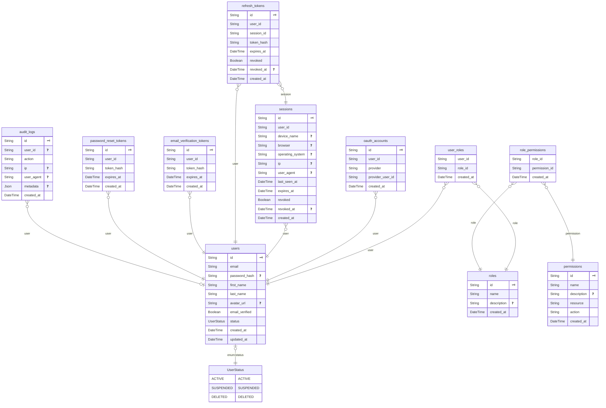

```mermaid
erDiagram

        UserStatus {
            ACTIVE ACTIVE
SUSPENDED SUSPENDED
DELETED DELETED
        }
    
  "users" {
    String id "🗝️"
    String email 
    String password_hash "❓"
    String first_name 
    String last_name 
    String avatar_url "❓"
    Boolean email_verified 
    UserStatus status 
    DateTime created_at 
    DateTime updated_at 
    }
  

  "roles" {
    String id "🗝️"
    String name 
    String description "❓"
    DateTime created_at 
    }
  

  "permissions" {
    String id "🗝️"
    String name 
    String description "❓"
    String resource 
    String action 
    DateTime created_at 
    }
  

  "user_roles" {
    String user_id 
    String role_id 
    DateTime created_at 
    }
  

  "role_permissions" {
    String role_id 
    String permission_id 
    DateTime created_at 
    }
  

  "oauth_accounts" {
    String id "🗝️"
    String user_id 
    String provider 
    String provider_user_id 
    DateTime created_at 
    }
  

  "sessions" {
    String id "🗝️"
    String user_id 
    String device_name "❓"
    String browser "❓"
    String operating_system "❓"
    String ip "❓"
    String user_agent "❓"
    DateTime last_seen_at 
    DateTime expires_at 
    Boolean revoked 
    DateTime revoked_at "❓"
    DateTime created_at 
    }
  

  "refresh_tokens" {
    String id "🗝️"
    String user_id 
    String session_id 
    String token_hash 
    DateTime expires_at 
    Boolean revoked 
    DateTime revoked_at "❓"
    DateTime created_at 
    }
  

  "email_verification_tokens" {
    String id "🗝️"
    String user_id 
    String token_hash 
    DateTime expires_at 
    DateTime created_at 
    }
  

  "password_reset_tokens" {
    String id "🗝️"
    String user_id 
    String token_hash 
    DateTime expires_at 
    DateTime created_at 
    }
  

  "audit_logs" {
    String id "🗝️"
    String user_id "❓"
    String action 
    String ip "❓"
    String user_agent "❓"
    Json metadata "❓"
    DateTime created_at 
    }
  
    "users" |o--|| "UserStatus" : "enum:status"
    "user_roles" }o--|| users : "user"
    "user_roles" }o--|| roles : "role"
    "role_permissions" }o--|| roles : "role"
    "role_permissions" }o--|| permissions : "permission"
    "oauth_accounts" }o--|| users : "user"
    "sessions" }o--|| users : "user"
    "refresh_tokens" }o--|| users : "user"
    "refresh_tokens" }o--|| sessions : "session"
    "email_verification_tokens" }o--|| users : "user"
    "password_reset_tokens" }o--|| users : "user"
    "audit_logs" }o--|o users : "user"
```
