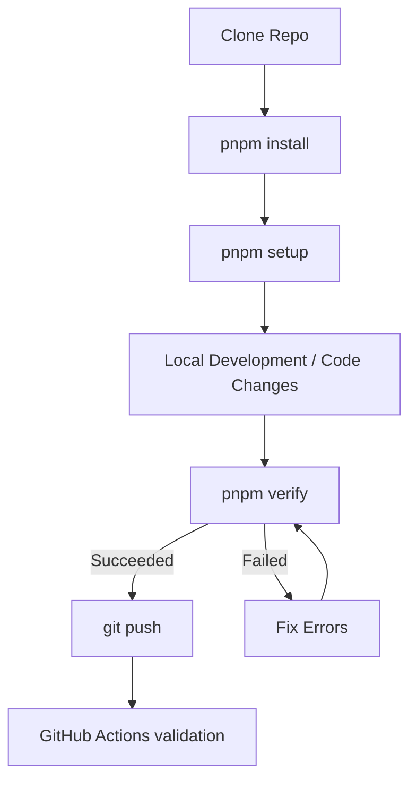
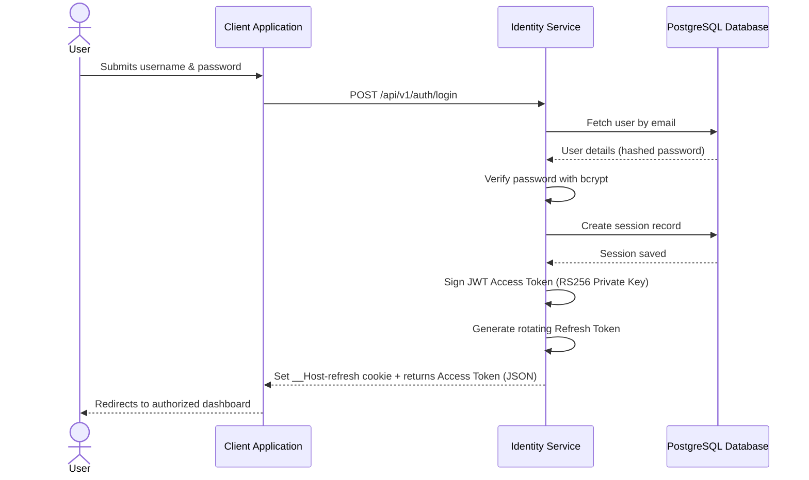
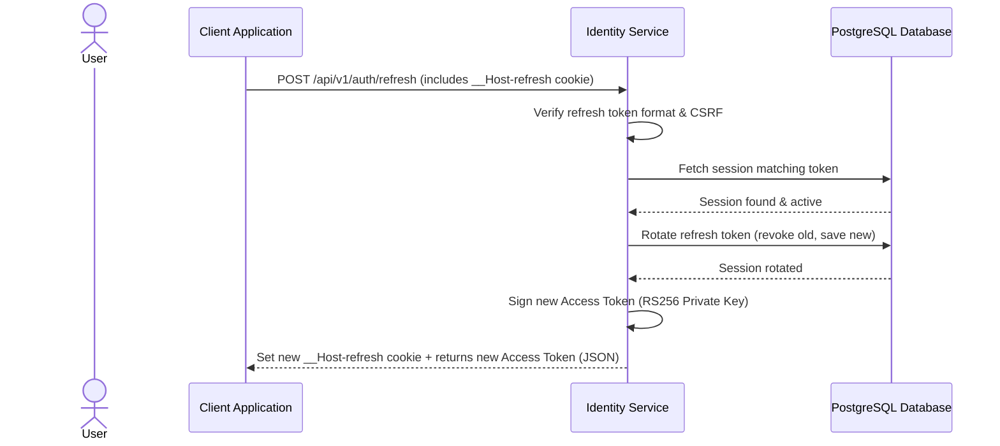
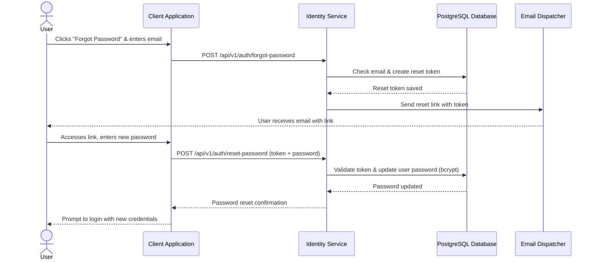

# Identity Service

[](https://nodejs.org/)
[](https://pnpm.io/)
[](https://www.prisma.io/)
[](https://vitest.dev/)
[](https://www.docker.com/)

A robust, production-ready, reusable generic **Identity Service** designed to handle security, authentication, and authorization for modern web applications. Built on Node.js using Express, TypeScript (strict mode), and Prisma ORM.

---

## Quick Start

Get your environment ready in minutes by following this simple workflow:

```text
git clone
  ↓
pnpm install
  ↓
pnpm setup   (verifies engine versions, configures .env & generates RSA keys)
  ↓
pnpm prisma migrate deploy
  ↓
pnpm seed    (populates DB with default roles & initial admin user)
  ↓
pnpm dev     (starts local development server)
```

---

## Contributor Lifecycle

The diagram below details the standard contributor workflow from cloning the repository to submitting verified changes to GitHub:



---

## Project Structure & Architecture

Below is a detailed guide describing the responsibilities of each primary directory in this workspace:

### Root Directories
- [prisma/](./prisma): Houses the database configuration including `schema.prisma` and database migrations.
- [scripts/](./scripts): Contains utility scripts for environment initialization, cryptography key generation, environment diagnostics (`doctor`), and repository verification pipeline (`verify`).
- [docs/](./docs): Contains API specifications (OpenAPI 3.1 contract), database entity-relationship diagrams (ERD), and Swagger UI configurations.
- [tests/](./tests): Contains end-to-end integration and system verification test suites.
- [generated/](./generated): Output directory for generated artifacts like TypeScript SDK types.

### Application Source Code (`src/`)
- [src/config/](./src/config): Manages configurations, cookies, constants, and Zod-based environment variable validation.
- [src/docs/](./src/docs): Registers Swagger documentation endpoints and packages OpenAPI resources.
- [src/infrastructure/](./src/infrastructure): Manages connection drivers and instances, such as the global Prisma database client.
- [src/middleware/](./src/middleware): Stores global middleware including error handling, rate limiting, request validation, CORS, and CSRF protection.
- [src/modules/](./src/modules): Houses the application modules (e.g. Authentication, Sessions, Users) containing their respective controllers, repositories, services, and schemas.
- [src/routes/](./src/routes): Registers global HTTP endpoints and mounts individual domain routers.
- [src/shared/](./src/shared): Holds cross-cutting utilities, generic types, and custom helper classes.
- [src/app.ts](./src/app.ts): Constructs the Express application instance, configures security headers, and applies route bindings.
- [src/server.ts](./src/server.ts): Launches the HTTP server, connects to databases, and handles OS process signals for graceful shutdown.

---

## Authentication & Cryptographic Flows

The Identity Service processes authentication and security challenges using secure, modern design patterns:

### Registration & Login Flow
- **Registration**: Collects credentials, verifies if the user exists, hashes passwords with bcrypt, creates the user record, and generates an opaque verification token to send activation emails.
- **Login**: Verifies credentials, registers a secure session in the database, generates access/refresh tokens, writes the refresh token inside a secure, HTTP-only `__Host-refresh` cookie, and returns the short-lived JWT access token.



### Access Token Refresh Flow
Access tokens are short-lived. Clients automatically query the `/auth/refresh` endpoint using the `__Host-refresh` cookie to retrieve a new access token without requiring manual credentials.



### Password Recovery Flow
Provides an asynchronous challenge-response loop to reset forgotten passwords securely using single-use opaque tokens.



---

## Environment & Configuration

### Prerequisites
- **Node.js**: version `>=22.19.0`
- **pnpm**: version `>=9`
- **Docker**: (Recommended for running PostgreSQL and integrations locally)

### Configuration Variables (`.env`)
Run `pnpm env:init` to create your initial `.env` file from `.env.example`. Key configuration options include:
- `PORT`: Binds Express to this port (default: `3000`).
- `DATABASE_URL`: Connection URI for PostgreSQL database.
- `CORS_ORIGINS`: Comma-separated list of allowed origins.
- `BCRYPT_SALT_ROUNDS`: Complexity factor for hashing passwords (must be between `10` and `15`).
- `JWT_PRIVATE_KEY` / `JWT_PUBLIC_KEY`: 2048-bit RS256 RSA keypair in PEM format (newlines escaped as literal `\n`). Can be automatically managed using `pnpm setup` or `pnpm keys:env`.
- `SEED_DEFAULT_ADMIN`: If set to `true`, `pnpm seed` will create a default administrator account.
- `DEFAULT_ADMIN_EMAIL` / `DEFAULT_ADMIN_PASSWORD`: Credentials for the default administrator.

---

## CLI Command Reference

All project commands are categorized below for reference:

| Category | Command | Description |
| :--- | :--- | :--- |
| **Setup** | `pnpm setup` | Automated project bootstrapper. Validates environment, copies `.env` template, generates RSA keys, configures JWT settings, and builds the Prisma database client. |
| | `pnpm env:init` | Safely initializes the `.env` configuration file from `.env.example`. Does not overwrite existing settings. |
| | `pnpm keys:generate` | Generates a new 2048-bit RSA key pair under `keys/` in PEM format. |
| | `pnpm keys:env` | Formats local PEM keys as single-line strings and injects them directly into the `.env` variables list. |
| **Development** | `pnpm dev` | Boots the Express development server with file watch and Hot Reloading enabled. |
| | `pnpm build` | Compiles TypeScript source files into executable Javascript under `dist/`. |
| | `pnpm start` | Launches the compiled production Javascript application. |
| | `pnpm lint` | Audits TypeScript source code for stylistic guidelines and patterns using ESLint. |
| | `pnpm lint:fix` | Runs ESLint and automatically corrects style errors and format alerts. |
| | `pnpm format` | Runs Prettier to auto-format source files across the codebase. |
| **Database** | `pnpm prisma:generate` | Builds TypeScript type definitions corresponding to the database models. |
| | `pnpm prisma:studio` | Launches an interactive database browser client. |
| | `pnpm seed` | Runs database seeder, creating system roles and default admin credentials. |
| **Testing** | `pnpm test` | Runs the test suites using Vitest. |
| | `pnpm test:local` | Automatically provisions a Dockerized test database, deploys migrations, runs Vitest integration tests, and tears down the database container when finished. |
| | `pnpm test:db:up` | Manually boots the Docker test database container and waits for it to become ready. |
| | `pnpm test:db:down` | Shuts down the Docker test database container and cleans all associated data volumes. |
| **OpenAPI** | `pnpm openapi` | Compiles, validates, and builds TypeScript client models using Orval based on the OpenAPI contract. |
| **Diagnostics** | `pnpm doctor` | Runs diagnostics to ensure system engine versions, databases, migrations, variables, and cryptographic configurations are completely healthy. |
| | `pnpm verify` | Runs sequential repository checks (`lint` → `build` → `openapi` → `test:local`) to confirm the project is in a push-ready state. |

---

## License

This project is licensed under the [MIT License](./LICENSE).
