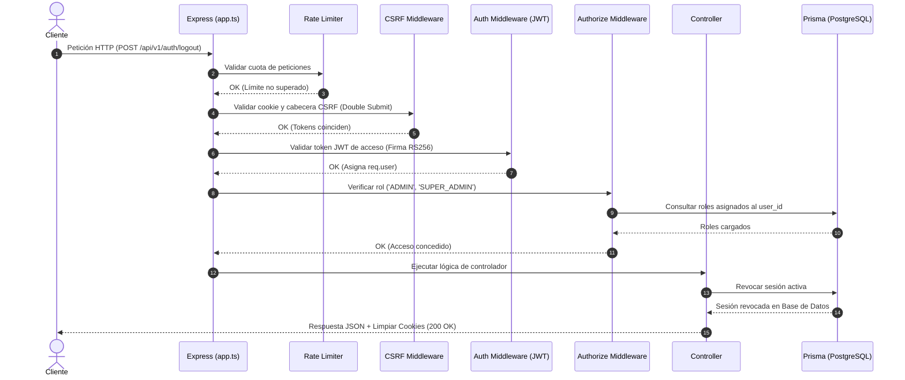

# Elevo Auth Service

[](https://nodejs.org/)
[](https://pnpm.io/)
[](https://www.prisma.io/)
[](https://vitest.dev/)
[](https://www.docker.com/)

Servicio de Autenticación y Autorización robusto para la plataforma SaaS **elevoCv**, desarrollado en Node.js con Express, TypeScript (modo estricto) y Prisma ORM.

---

## Características de Seguridad

* **Firma JWT RS256**: Autenticación asimétrica basada en par de llaves (clave privada para firmar en el servidor, clave pública para verificar externamente).
* **Protección CSRF (Double Submit Cookie)**: Validación criptográfica mediante cabecera `x-csrf-token` y cookie segura `csrfToken`.
* **Control de Acceso Basado en Roles (RBAC)**: Middleware flexible `authorize(...roles)` que realiza consultas eficientes a las tablas de `auth.roles` y `auth.user_roles`.
* **Gestión de Sesión Activa**: Soporte para renovación y revocación en tiempo real de múltiples sesiones concurrentes por usuario.
* **Tokens con HttpOnly Cookies**: Token de refresco (`__Host-refresh`) almacenado de forma segura y blindado contra ataques XSS.
* **Rate Limiting dedicado**: Límites de peticiones configurados por endpoint (registro, inicio de sesión, envío de correos de verificación, recuperación de contraseñas, etc.).

---

## Arquitectura de Peticiones



---

## Requisitos Previos

* **Node.js**: `>=22.19.0`
* **pnpm**: `>=9`
* **Docker / Docker Compose**: (Requerido para ejecutar la suite de pruebas local)
* **PostgreSQL**: (Si deseas correr el servidor local de desarrollo fuera de Docker)

---

## Configuración y Despliegue Local

### 1. Instalar Dependencias
```bash
pnpm install
```

### 2. Configurar Variables de Entorno
Copia el archivo de ejemplo para el entorno de desarrollo:
```bash
cp .env.example .env
```
Abre el archivo `.env` recién creado y ajusta las variables de entorno, principalmente la URL de conexión a tu base de datos PostgreSQL (`DATABASE_URL`).

### 3. Generar el Cliente de Prisma
```bash
pnpm prisma:generate
```

### 4. Ejecutar Migraciones de Base de Datos
Aplica la base de migraciones a tu base de datos local:
```bash
pnpm prisma migrate deploy
```

### 5. Iniciar Servidor de Desarrollo
```bash
pnpm dev
```
El servidor arrancará en el puerto configurado (por defecto `3000`) con soporte para recarga en caliente (hot reload) a través de `node --watch`.

---

## Ejecución de Pruebas (Testing)

El proyecto cuenta con una suite completa de **42 pruebas de integración y unitarias** con Vitest que validan todos los flujos de seguridad (registro, inicio de sesión, sesiones concurrentes, expiración de tokens, RBAC, etc.).

### Método Recomendado (Automatizado con Docker)
Ejecuta el ciclo de vida completo del entorno de pruebas con un solo comando. Este script se encarga de:
1. Levantar una base de datos PostgreSQL 17 efímera en Docker (puerto `55432`).
2. Generar dinámicamente un par de llaves RSA seguras para firmar los tokens de los tests.
3. Ejecutar las migraciones y compilar Prisma.
4. Correr la suite de pruebas de Vitest con reporte de cobertura de código.
5. Apagar y limpiar el contenedor de Docker al finalizar.

```bash
pnpm test:local
```

### Método Manual (Paso a Paso)
Si deseas controlar el flujo de pruebas manualmente o necesitas depurar un test específico:

1. **Levantar base de datos Docker de pruebas**:
   ```bash
   pnpm test:db:up
   ```

2. **Configurar claves de prueba**:
   Copia el archivo [.env.test.example](file:///c:/Users/elizo/Documents/Elevo/auth/.env.test.example) como `.env.test`. Puedes usar las claves de prueba que ya vienen por defecto en la plantilla o generar unas nuevas.
   ```bash
   cp .env.test.example .env.test
   ```

3. **Ejecutar las pruebas de integración**:
   ```bash
   pnpm test:integration
   ```

4. **Detener y limpiar la base de datos de pruebas**:
   ```bash
   pnpm test:db:down
   ```

---

## OpenAPI

La especificación OpenAPI 3.1 de este servicio actúa como la **única fuente de verdad** para documentar, validar y generar el SDK del cliente.

### Comandos de OpenAPI

* **Generar documentación y SDK (pauta completa)**
  ```bash
  pnpm openapi
  ```

* **Validar la especificación**
  ```bash
  pnpm openapi:validate
  ```

* **Generar tipos TypeScript y Hooks de React Query (SDK)**
  ```bash
  pnpm openapi:types
  ```

### Puntos de Acceso

* **Swagger UI (Local)**: [http://localhost:3000/docs](http://localhost:3000/docs)
* **Especificación Raw (JSON)**: [http://localhost:3000/docs/openapi.json](http://localhost:3000/docs/openapi.json)

---

## Scripts Disponibles

| Script | Descripción |
|---|---|
| `pnpm dev` | Inicia el servidor de desarrollo local usando `--watch` y `tsx`. |
| `pnpm build` | Compila el código TypeScript a JavaScript de producción en `dist/`. |
| `pnpm start` | Inicia la versión compilada en producción. |
| `pnpm lint` | Analiza el código con ESLint en busca de errores de tipado o estilo. |
| `pnpm lint:fix` | Corrige automáticamente problemas sencillos de ESLint. |
| `pnpm format` | Da formato al código fuente utilizando Prettier. |
| `pnpm test` | Ejecuta las pruebas unitarias e integradas una sola vez con cobertura habilitada. |
| `pnpm test:integration` | Ejecuta la generación de Prisma, validación de esquemas, migración y tests. |
| `pnpm test:local` | Orquesta todo el entorno de pruebas Docker de principio a fin (Setup -> Test -> Cleanup). |
| `pnpm openapi` | Ejecuta la validación, linting, bundling y la generación del SDK de Orval en secuencia. |
| `pnpm openapi:validate` | Valida la especificación OpenAPI compilada en `docs/openapi/openapi.json` con Redocly. |
| `pnpm openapi:lint` | Linter de Redocly para asegurar conformidad del contrato. |
| `pnpm openapi:bundle` | Compila la especificación de TypeScript a JSON estático. |
| `pnpm openapi:types` | Genera modelos de TypeScript y hooks de React Query mediante Orval en `generated/sdk/openapi.ts`. |
