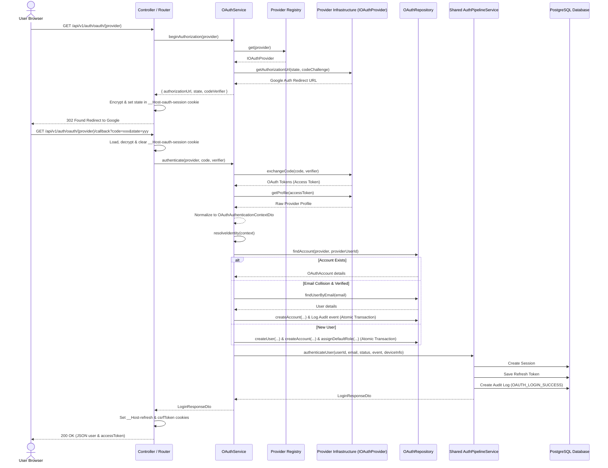

# Developer Guide — OAuth Provider Integration

This guide details the architecture of the Identity Service's federated authentication module, explaining how to implement, register, configure, and verify new identity providers.

---

## 1. Module Responsibilities & Boundaries

To preserve clean architecture, the OAuth module has highly defined boundaries:

### What the OAuth module IS responsible for:
- **Authorization Code Flow with PKCE**: Coordinating authorization redirects and PKCE validation parameter generation.
- **Provider Communication**: Performing token exchanges and retrieving profile structures from external servers.
- **Identity Normalization**: Converting provider-specific payloads into normalized, transport-independent application DTOs.
- **OAuth Account Resolution**: Determining whether an external identity corresponds to a new user or an existing local account (incorporating anti-takeover safety rules).
- **Delegation to the Authentication Pipeline**: Invoking the centralized, shared internal session and token management.

### What the OAuth module is NOT responsible for:
- **User Authorization (RBAC)**: Assigning or evaluating permissions or security scopes.
- **Business Profile Management**: Storing or updating commercial user profiles, attributes, or telemetry fields.
- **MFA (Multi-factor Authentication)**: Handling downstream step-up authentication or risk analysis.
- **Local Credentials**: Hashing or managing passwords.
- **Account Verification/Recovery**: Generating verification links or processing password recovery tokens.

These external concerns remain owned strictly by the core `Auth` and `Users` modules.

---

## 2. OAuth Authentication Flow (Sequence Diagram)

The following diagram maps the entire lifecycle of an OAuth login, from redirect initiation to session establishment:



---

## 3. Guide to Adding a New Provider

The OAuth module is designed in compliance with the **Open/Closed Principle**. To add a new provider (e.g. GitHub, Microsoft, Apple), follow these steps:

### Step 1: Implement `IOAuthProvider`
Create a new provider class under `src/modules/oauth/infrastructure/providers/{name}/{name}-oauth.provider.ts`:
```typescript
import type { IOAuthProvider, OAuthProviderMetadata } from '../../application/contracts/oauth-provider.interface.js';
import type { OAuthTokensDto } from '../../application/dto/oauth-tokens.dto.js';
import type { OAuthProfileDto } from '../../application/dto/oauth-profile.dto.js';

export class GitHubOAuthProvider implements IOAuthProvider {
  readonly metadata: OAuthProviderMetadata = {
    type: 'github',
    displayName: 'GitHub',
  };

  async getAuthorizationUrl(state: string, codeChallenge: string): Promise<string> {
    // Generate Github accounts authorization redirect URI
  }

  async exchangeCode(code: string, codeVerifier: string): Promise<OAuthTokensDto> {
    // Perform code-to-token post exchange
  }

  async getProfile(accessToken: string): Promise<OAuthProfileDto> {
    // Fetch profile and map/normalize fields
  }
}
```

### Step 2: Configure Environment Variables
1. Define the config schema variables in `src/config/env.ts`.
2. Add variables to `.env.example` and `.env.test.example`:
   ```bash
   GITHUB_CLIENT_ID=your-client-id
   GITHUB_CLIENT_SECRET=your-client-secret
   GITHUB_REDIRECT_URI=http://localhost:3000/api/v1/auth/oauth/github/callback
   ```

### Step 3: Register Provider in Composition Root
Update `src/infrastructure/composition/oauth/oauth.composition.ts`:
1. Import `GitHubOAuthProvider`.
2. Instantiate `githubProvider` passing the environment client credentials.
3. Map it in the registry:
   ```typescript
   const providers = new Map<OAuthProviderType, IOAuthProvider>([
     ['google', googleProvider],
     ['github', githubProvider],
   ]);
   ```

### Step 4: Map HTTP endpoints in Controller & Router
Update `oauth.controller.ts` and `oauth.router.ts` to add endpoints matching the redirect and callback path for the new provider. No business logic needs modification.
